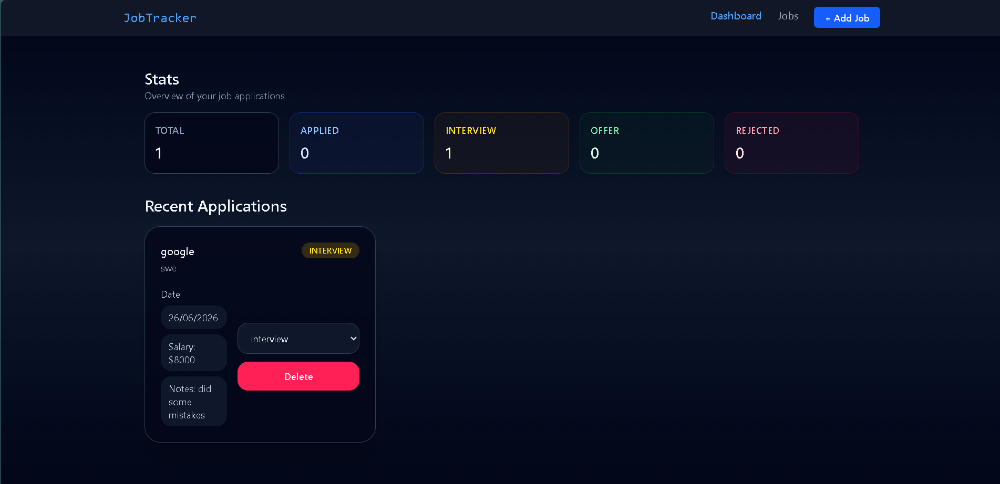
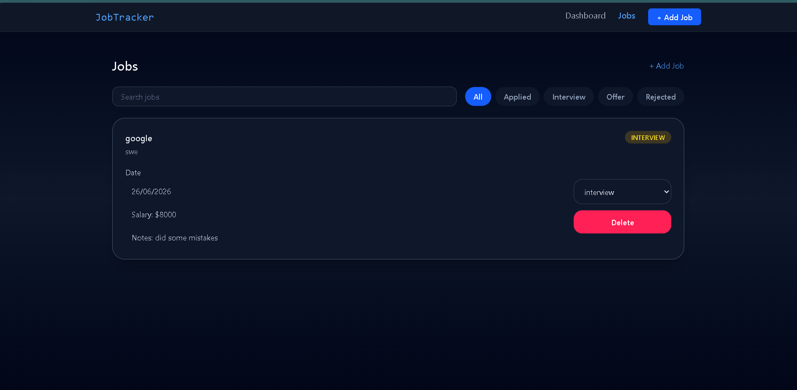
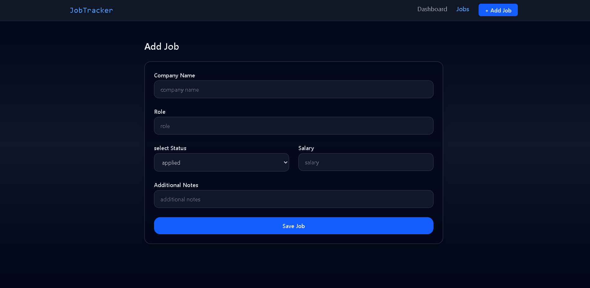
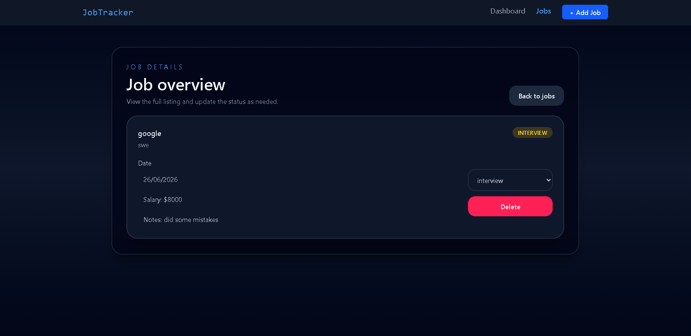

# Job Tracker

A production-grade job application tracking app built with React and TypeScript. Add jobs you've applied to, track their status, filter and search through applications, and view dashboard stats — all persisted across sessions.

**Live Demo → [job-tracker-one-rho.vercel.app](https://job-tracker-one-rho.vercel.app)**

---

## What It Does

- Add job applications with company, role, status, salary, and notes
- Update application status as it progresses — Applied, Interview, Offer, Rejected
- Filter jobs by status and search by company or role
- Dashboard showing total applications and breakdown by status
- Data persists across page refreshes using redux-persist

---

## Tech Stack

| Category | Tool |
|---|---|
| Framework | React 18 |
| Language | TypeScript |
| Build Tool | Vite |
| Styling | Tailwind CSS v4 |
| State Management | Redux Toolkit |
| Data Persistence | redux-persist |
| Data Fetching | TanStack Query |
| Forms | React Hook Form |
| Routing | React Router v6 |
| Deployment | Vercel |

---

## Project Structure

```
src/
  features/
    jobs/
      components/
        JobCard.tsx       — single job display with status update + delete
        JobForm.tsx       — add job form with validation
        JobFilters.tsx    — filter buttons + search input
        JobList.tsx       — job list with filter/search logic
        JobStats.tsx      — dashboard stat cards
      jobsSlice.ts        — Redux slice — all state and actions
      types.ts            — TypeScript interfaces
      index.ts            — feature public API
  pages/
    Dashboard.tsx         — stats overview + recent applications
    Jobs.tsx              — full job list page
    AddJob.tsx            — add job page
    JobDetail.tsx         — single job detail page
  shared/
    components/
      Navbar.tsx          — navigation with active link highlighting
      Layout.tsx          — page wrapper with Outlet
      ErrorBoundary.tsx   — catches render errors
    context/
      ThemeContext.tsx     — light/dark theme
  store/
    store.ts              — Redux store with persistence config
  App.tsx                 — routes + lazy loading
  main.tsx                — providers setup
```

---

## Pages

### Dashboard `/`

Overview of all applications. Shows stat cards broken down by status and the 5 most recent applications.

### Jobs `/jobs`

Full list of all applications. Filter by status — All, Applied, Interview, Offer, Rejected. Search by company name or role. Each card shows status, date, salary if provided, and notes.

### Add Job `/jobs/add`

Form to add a new application. Fields: company name, role, status, salary (optional), notes (optional). Validates required fields and redirects to Jobs on submit.

### Job Detail `/jobs/:id`

Full detail view of a single application. Update status via dropdown. Delete the application with confirmation navigation back to the list.

---

## State Architecture

All job data lives in Redux. Filtering and search are derived in the component — raw data in the store is never mutated by filters.

```
Redux Store
  jobs/
    items[]        — all job applications
    filter         — active status filter
    searchQuery    — active search string
```

Actions: `addJob`, `removeJob`, `updateStatus`, `setFilter`, `setSearchQuery`

Data persists to localStorage via redux-persist and rehydrates on page load.

---

## Key Implementation Details

**TypeScript throughout** — all components, Redux actions, and form data are fully typed. `PayloadAction<T>` on every reducer. `RootState` typed selectors.

**React Hook Form** — form state managed by RHF, not useState. No re-render on every keystroke. Validation rules defined per field.

**Lazy loading** — all four pages loaded with `React.lazy` and wrapped in `Suspense`. Initial bundle is smaller, pages load on demand.

**Error Boundary** — class component wrapping all routes. Any render error shows a fallback UI instead of a blank screen.

**Nested routing** — Layout component uses React Router's `Outlet`. Navbar stays mounted, only page content swaps on navigation.

---

## Running Locally

```bash
git clone https://github.com/surajthapa-code/job-tracker
cd job-tracker
npm install
npm run dev
```

Open `http://localhost:5173`

---

## Build

```bash
npm run build
```

TypeScript compiled, Vite bundles, output in `/dist`.

---

## What I Learned Building This

- Feature-based folder structure at scale
- Redux Toolkit with full TypeScript typing — `PayloadAction`, `Omit`, `Record`
- Why derived state belongs in components, not in the Redux slice
- `e.stopPropagation()` for nested click handlers
- `useParams` typed with generics for route params
- `redux-persist` configuration and `PersistGate` hydration
- Difference between `NavLink` and `Link` for active route styling
- Production deployment with Vercel
